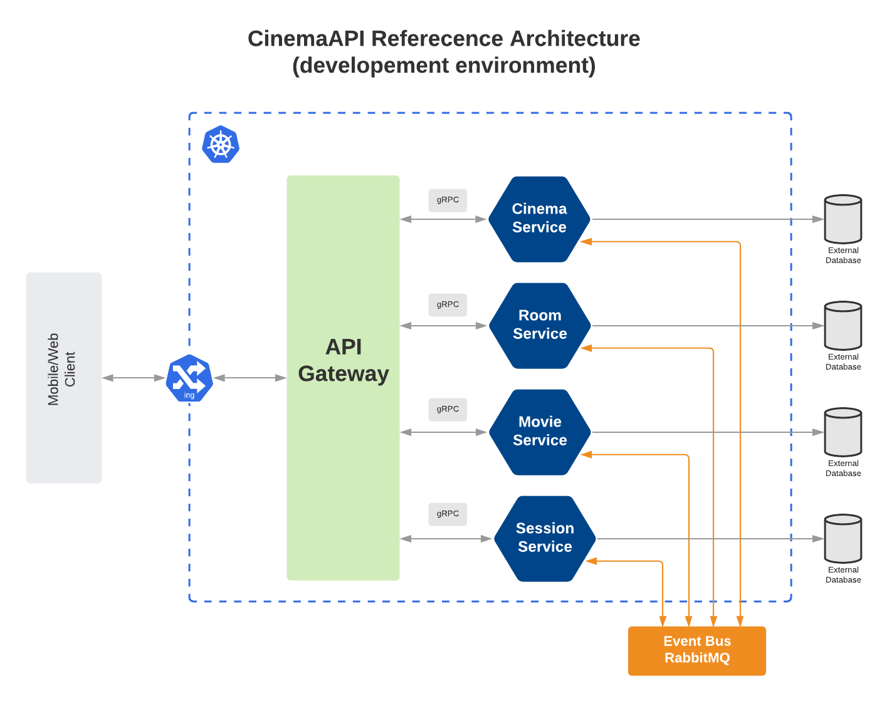

# CINEMA-API
A cinema management api based on a simplified microservices architecture. (currently on development)

## Architecture Overview
The architecture proposes a simple microservice oriented architecture and a variant of the api gateway pattern that runs on a kubernetes solution.

Each microservice works autonomously (having its own data/database) and have a hybrid approach to connectivity: gRPC to connect synchronously with the gateway and a Event Bus to connect asynchronously with other microservices.

The api gateway serves as a backend aggregator that connects to all microservices and create a collection of all endpoints into one service. Alternatively, it can be futher separated into multiple gateways for each platform (e.g. one for mobile and another for web).

The Kubernetes Ingress Controller chosen for this architecture is Traefik - a feature rich and highly configurable proxy that has great integration with kubernetes.

## Possible Changes

- Opitionally, the movie microservice can be turned into a external service, connecting with a existing movies api (e.g. IMDB api).

- Payment and Ticket management is not a part of the current achitecture, but each can be made into its own microservice on a later date.

- The organization of the code can be improved further by applying concepts like Clean Architecture and CQRS for a better decoupling and cleaner code.

- Alternatively, the api gateway can be made into a GraphQL API.

- The Architecture can be improved futher by adding Service discovery mechanisms (e.g. Istio), log collection and observability/metrics.

- A better test coverage for each microservice will be added in the future.
- The CI/CD pipeline can be improved futher. (probably after the better test coverage)
